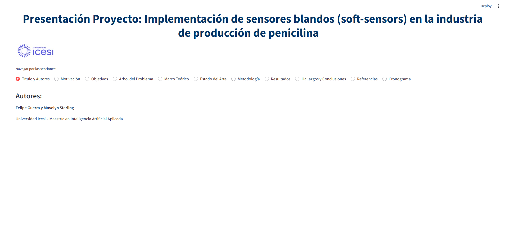

# 🧪 Reto Insulina INRAE

📌 **Maestría en Inteligencia Artificial Aplicada**

📍 **Institución:** Universidad Icesi y el Instituto Nacional de Investigación sobre Agricultura, Alimentación y Medio Ambiente de Francia (INRAE)

## 🎯 Objetivo del Proyecto

Este proyecto investiga el uso de **redes neuronales recurrentes (RNN)** en la industria de producción de  **penicilina** , explorando la implementación de **sensores blandos (soft-sensors)** para la optimización de procesos industriales.

## 📁 Estructura del Repositorio

```
📂 PROYECTO_RETO_INSULINA_INRAE
│── 📂 data
│   ├── 100_Batches_IndPenSim_V3.csv   # Datos de simulación de la producción de penicilina
│
│── 📂 notebook
│   ├── analysis-of-industrial-scale-penicillin-simulation.ipynb  # Análisis de simulaciones a escala industrial
│   ├── IndPenSim_Summary_data_notebook_V3.ipynb  # Resumen y exploración de datos
│
│── 📂 src
│   ├── 📂 assets
│   │   └── correlacion.png  # Matriz de correlación de variables
│   ├── analisis_exploratorio.ipynb  # Análisis exploratorio de los datos
│   ├── analisis_univariado.ipynb  # Análisis univariado de los datos
│   ├── batches_seleccion_variables.ipynb  # Selección de variables
│   ├── batches_red_neuronal_articulo_normalizar.ipynb  # Implementación de RNN con las variables del articulo de referencia
│   ├── batches_red_neuronal_lasso_normalizar.ipynb  # Implementación de RNN con las variables seleccionadas por lasso
│   ├── batches_red_neuronal_pls_normalizar.ipynb  # Implementación de RNN con las variables seleccionadas por pls
│
│── 📂 temp # Archivos temporales de contexto
│── app.py  # Aplicación Streamlit para presentación del proyecto
│── logo.png  # Logo del proyecto
│── requirements.txt  # Dependencias del proyecto
│── .gitignore   # Archivos a excluir del control de versiones
│── README.md  # Este archivo
```

## 📊 Base de datos

El conjunto de datos fue generado mediante IndPenSim, una simulación matemática avanzada de un sistema de fermentación de penicilina de 100,000 litros. IndPenSim es la primera simulación que incorpora un dispositivo de espectroscopia Raman simulado para el desarrollo y evaluación de soluciones de control avanzadas en biotecnología.

El conjunto de datos generado contiene 100 lotes con mediciones detalladas del proceso y espectroscopia Raman (~2.5 GB), siendo ideal para análisis de big data, aprendizaje automático (ML) e inteligencia artificial (AI) en la industria biofarmacéutica.

* El dataset **`100_Batches_IndPenSim_V3.csv`** contiene simulaciones de producción de penicilina, que se analizarán para mejorar la predicción de variables clave mediante modelos de Machine Learning.

## 🛠️ Tecnologías Utilizadas

* **Python** 🐍
* **Pandas, NumPy** 📊
* **Scikit-learn, TensorFlow/PyTorch** 🔬
* **Jupyter Notebooks** 📒
* **Streamlit** 🚀

## 👥 Integrantes del Proyecto

* **Felipe Guerra**
* **Mavelyn Sterling**

## 🚀 Cómo Ejecutar el Proyecto

### 📋 Prerrequisitos

1. **Python 3.8 o superior**
2. **Git** para clonar el repositorio

### 🔧 Instalación y Configuración

1. **Clona este repositorio:**

   ```bash
   git clone https://github.com/tu-usuario/repo-insulina-inrae.git
   cd proyecto_reto_insulina_INRAE
   ```
2. **Crea y activa un entorno virtual:**

   ```bash
   # En Windows
   python -m venv .venv
   .venv\Scripts\activate

   # En macOS/Linux
   python3 -m venv .venv
   source .venv/bin/activate
   ```
3. **Instala las dependencias:**

   ```bash
   pip install -r requirements.txt
   ```

### 🎯 Ejecutar la Aplicación Streamlit

Para ejecutar la aplicación de presentación del proyecto:

```bash
# Asegúrate de que el entorno virtual esté activado
streamlit run app.py
```

La aplicación se abrirá automáticamente en tu navegador en `http://localhost:8501`



### 📊 Ejecutar Análisis en Jupyter Notebook

Para ejecutar los análisis detallados:

```bash
# Asegúrate de que el entorno virtual esté activado
jupyter notebook
```

Luego navega a la carpeta `src/` y abre los notebooks de análisis.

## 📱 Aplicación Streamlit

La aplicación `app.py` incluye:

- **Presentación interactiva** del proyecto
- **Navegación por secciones** con radio buttons
- **Tablas mejoradas** con `st.table()`
- **Visualizaciones** de resultados
- **Cronograma del proyecto**
- **Comparación de métodos** de selección de variables
